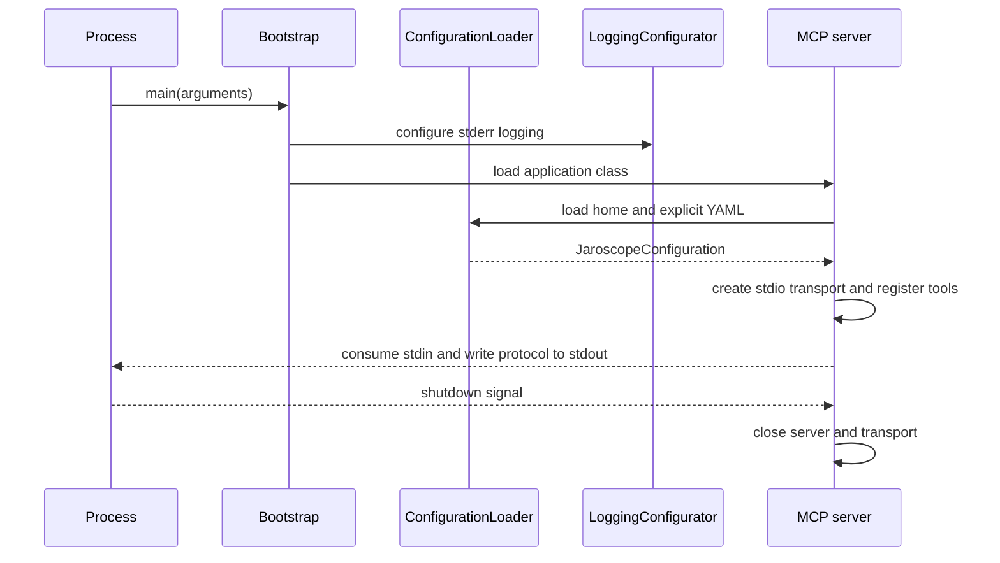

# Application

`JaroscopeBootstrap` configures Logback before loading the application class.
The application then loads layered configuration, creates the stdio transport,
registers tools, and waits for shutdown.



Stdout carries MCP JSON-RPC only. Logback writes diagnostics to stderr.

Build the distribution with:

```text
gradle :jaroscope-mcp:installDist
```
