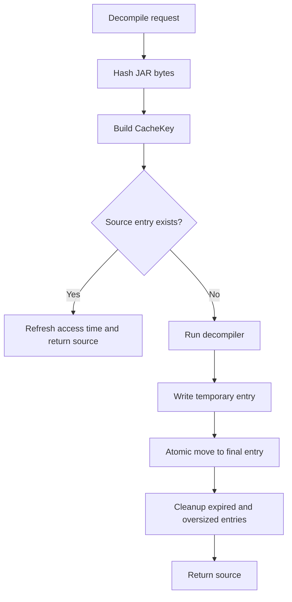

# Decompilation cache

`CacheStore` stores source by content identity. A cache hit requires the same
JAR bytes, class name, Java release, decompiler version, and options identity.



The cache is browsable by content hash:

```text
~/.jaroscope/cache/
  <jar-sha256>/
    artifact.properties
    java-21/vineflower-1.12.0/options-<options-hash>/sources/com/example/Widget.java
```

`artifact.properties` records the exact source filename and any embedded Maven,
manifest, or module identity claims. Those names are labels. The JAR byte hash
is the canonical artifact identity. Release, engine, and options directories
keep distinct source variants from colliding. Unsafe class-name path components
are encoded before becoming path names. Existing flat `.source` entries are
promoted to the new layout when read.

Temporary source and metadata files are created beside their final destination
and atomically renamed. Cleanup removes source files older than 30 days, then
least-recently-used source files until the configured 2 GiB source budget is
met. Both limits are configurable.

Cache filesystem operations use a JVM lock and an OS file lock stored in the
cache directory. This serializes cache reads, writes, and cleanup across threads
and JARoscope processes. Vineflower computation runs outside the lock, so work
for different JARs can proceed concurrently. Concurrent computations for one
key are permitted, but their cache writes cannot overlap.
