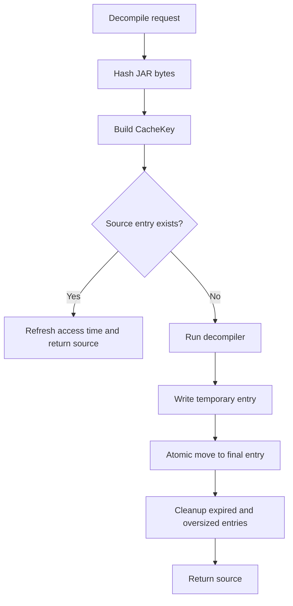

# Decompilation cache

`CacheStore` stores source by content identity. A cache hit requires the same
JAR bytes, class name, Java release, decompiler version, and options identity.

Entries are files below the configured `~/.jaroscope/cache` directory. Temporary
files use a separate suffix and are never considered cache entries. Cleanup
first removes entries older than 30 days, then removes least-recently-used
entries until the cache is at most 2 GiB. Both limits are configurable.

Cache filesystem operations use a JVM lock and an OS file lock stored in the
cache directory. This serializes cache reads, writes, and cleanup across threads
and JARoscope processes. Vineflower computation runs outside the lock, so work
for different JARs can proceed concurrently. Concurrent computations for one
key are permitted, but their cache writes cannot overlap.
