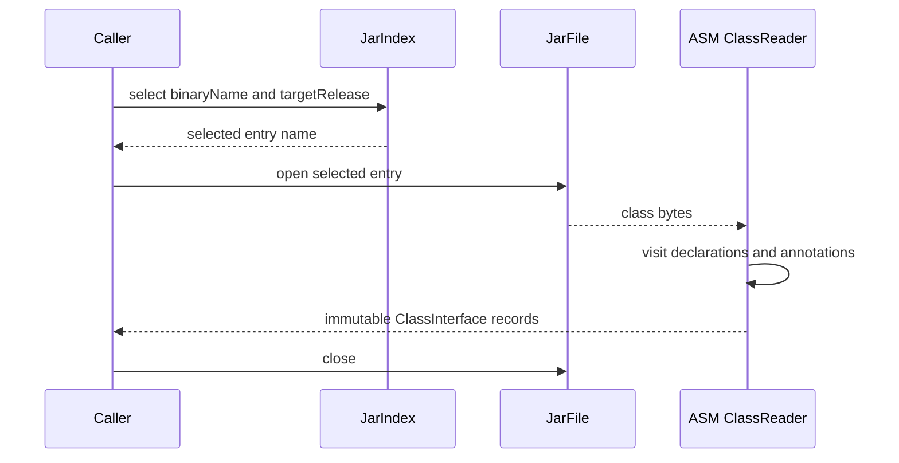
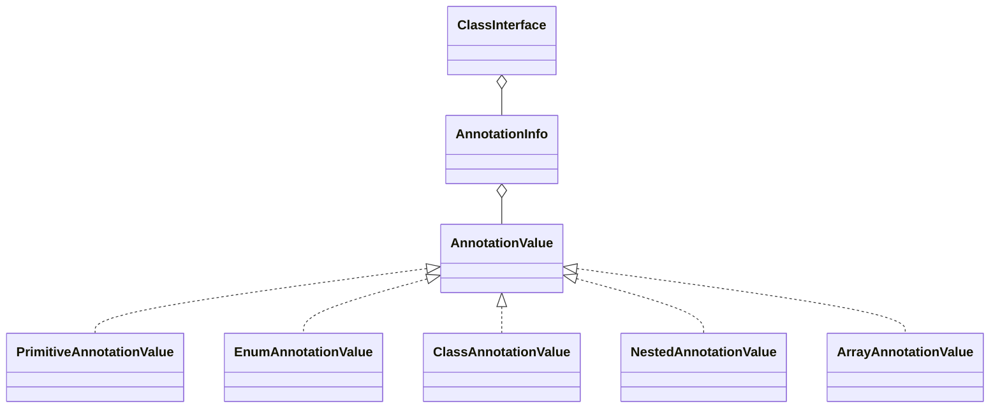

# Class interface extraction

`ClassInterfaceExtractor` reads the selected class entry from a JAR with ASM.
It returns project-owned records and never loads the class or its annotations.

The default result contains declared public and protected fields, constructors,
methods, generic signatures, and annotations. Synthetic and bridge members are
excluded. Inherited members are not resolved by this operation.

Annotation values remain unresolved metadata:

Class literals are returned as type names. They are never resolved through a
class loader.
