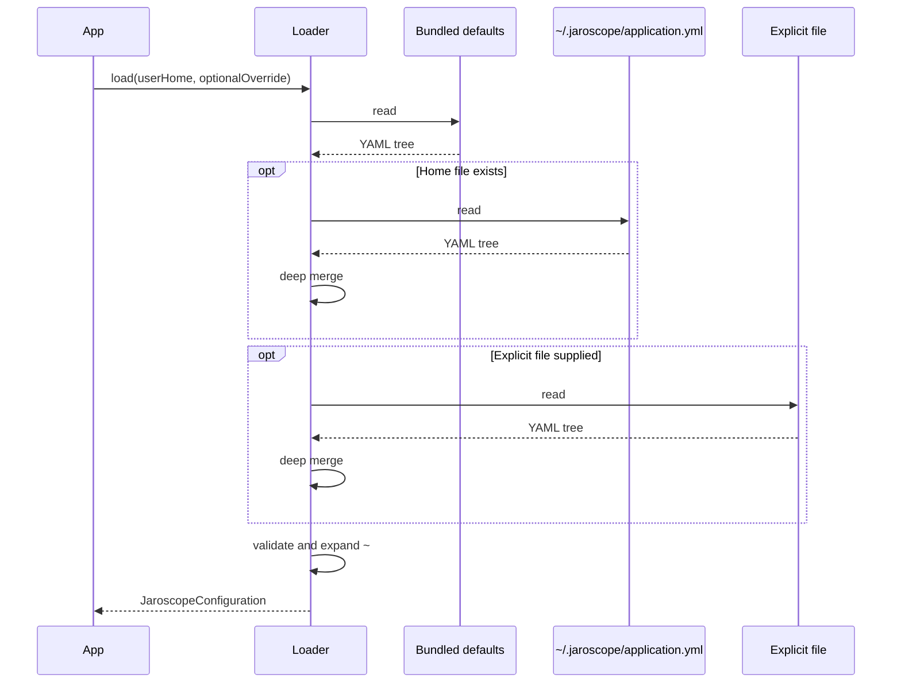
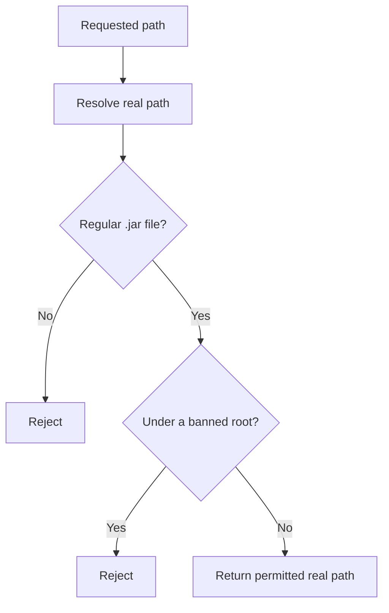

# Configuration and path policy

JARoscope loads configuration in three layers:

1. Bundled `application.yml` defaults.
2. `~/.jaroscope/application.yml`, when present.
3. An explicit configuration path, when supplied.

Later layers override matching values and preserve unrelated values. The
configuration library validates release, cache, and security settings before
returning a record used by the application.

The default maximum source response is 1 MiB and is configured with
`jaroscope.response.max-source-size`.

Background cache warming is enabled by default. Configure it with
`jaroscope.background-decompilation.enabled`, `max-concurrent-jars`, and
`max-classes`.

Invalid configuration raises `InvalidConfigurationException`. A rejected JAR
path raises `JarPathException`. Filesystem failures remain `IOException`.

`JarPathPolicy` resolves a requested path to its real path before checking it.
This prevents a symlink from bypassing a banned root. It accepts only regular
files with a `.jar` suffix. Banned roots are also resolved through existing
symlinked ancestors, including when the configured root's final path does not
yet exist.

