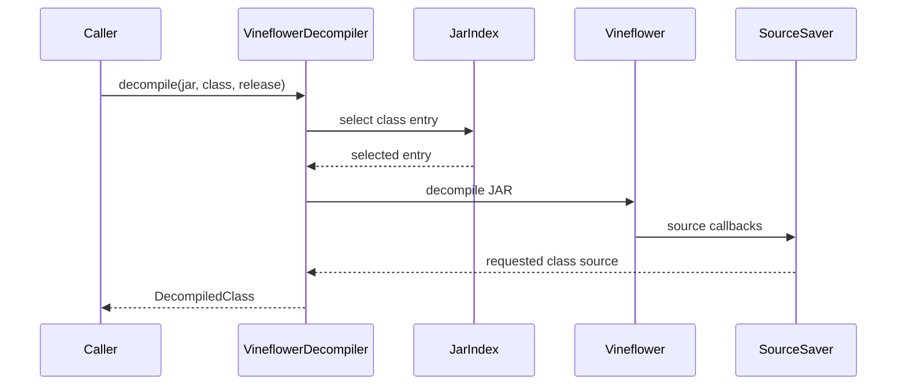

# Decompiler adapter

`VineflowerDecompiler` implements the project `Decompiler` interface. It first
uses `JarIndex` to verify the requested class and its release selection, then
passes the JAR to Vineflower. A memory-backed result saver retains only the
requested source.

The adapter does not write output files or load application classes. The
single-class path uses one Vineflower invocation. The batch path stages two
temporary release-resolved JAR views: requested classes as input, and all
selected classes as library context. Vineflower is invoked once for the batch,
and its result saver forwards each requested class as it is emitted. The
temporary views are deleted when the invocation ends.
