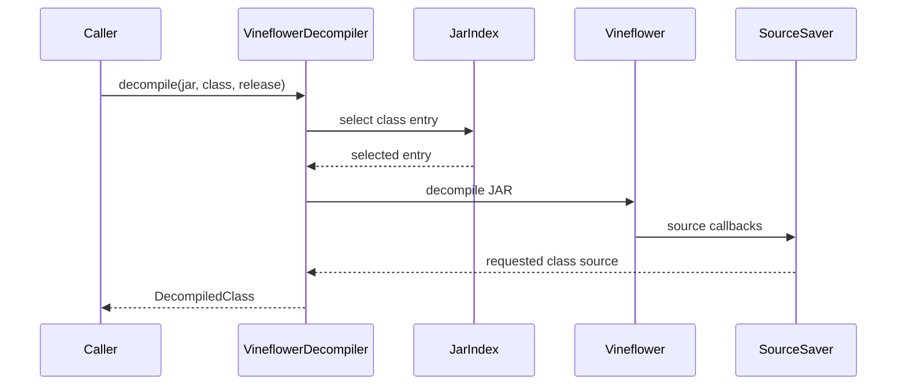

# Decompiler adapter

`VineflowerDecompiler` implements the project `Decompiler` interface. It first
uses `JarIndex` to verify the requested class and its release selection, then
passes the JAR to Vineflower. A memory-backed result saver retains only the
requested source.

The adapter does not write output files or load application classes. The
current implementation processes the input JAR for each request and retains
only the requested result. The cache increment will remove repeated work.
