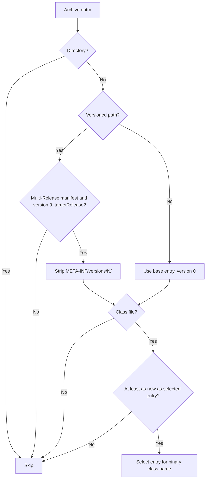
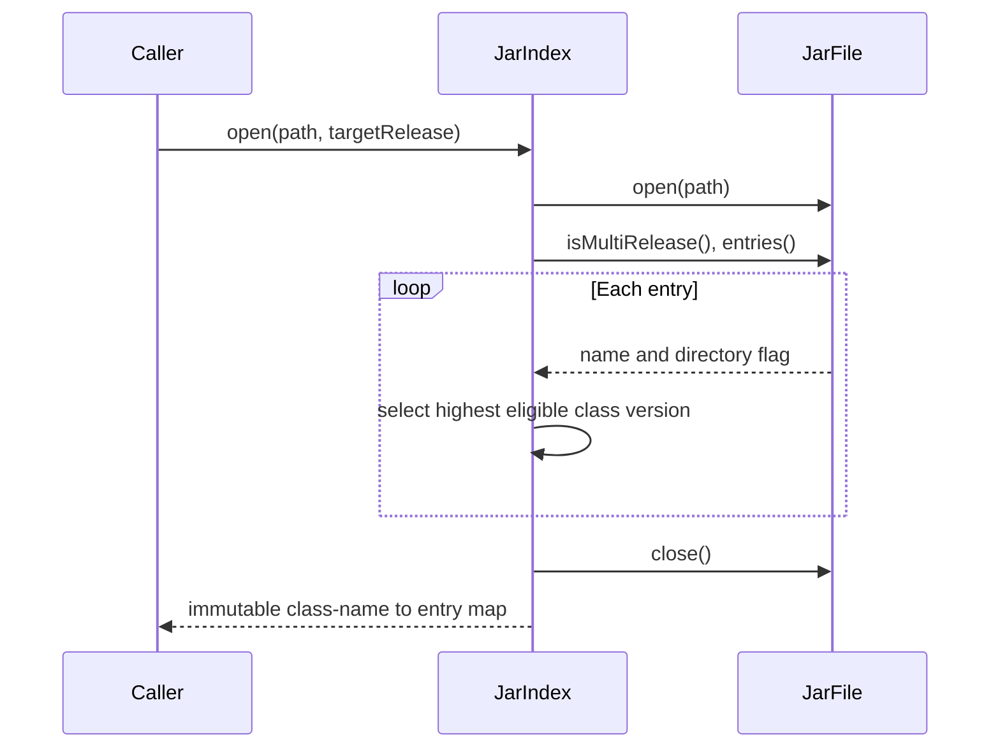

# JAR class index

`JarIndex.open(path, targetRelease)` maps binary class names to archive entries.
It reads JAR metadata, does not load classes, and closes the archive before
returning an immutable, name-sorted map.

In the bundled fixture, `example.Greeter` maps to `example/Greeter.class`
at release 11 and `META-INF/versions/17/example/Greeter.class` at release 21.
Entries under `META-INF/versions/` are ignored unless the JAR declares
`Multi-Release: true`.
