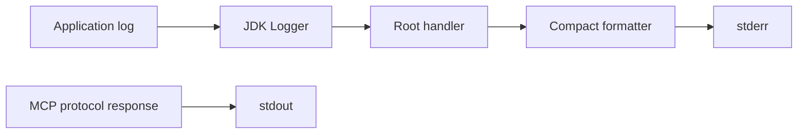

# Logging

JARoscope reserves stdout for MCP JSON-RPC messages. Diagnostics use stderr.
The default format is compact and human-readable:

```text
2026-10-06 18:42:11.284 INFO  [main] jaroscope.application - Configuration loaded targetRelease=21
2026-10-06 18:42:12.004 WARN  [mcp-1] jaroscope.cache - Cache miss key=ab12... reason=source-not-present
```

ANSI colors are enabled only when color mode is `AUTO`, stderr is the process
stderr stream, and the process has an interactive console.



The logging module exposes SLF4J, uses Logback at runtime, and configures its
ConsoleAppender to target stderr. Consumers call
`LoggingConfigurator.configure(...)` before the first logger is created, then
use SLF4J. Application classes should use Lombok's `@Slf4j` when they begin
emitting logs.
