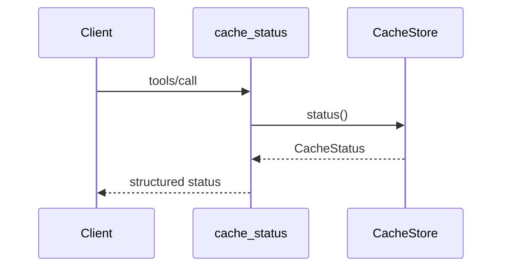

# `cache_status`

Returns usage and cleanup eligibility for the JARoscope-owned cache.
`entryCount` and `totalBytes` describe cached `.java` source files. Artifact
metadata and cache lock files are not included in the byte budget.

```json
{
  "entryCount": 12,
  "totalBytes": 43821,
  "expiredEntryCount": 1,
  "excessBytes": 0,
  "maxBytes": 2147483648,
  "maxAge": "PT720H"
}
```


