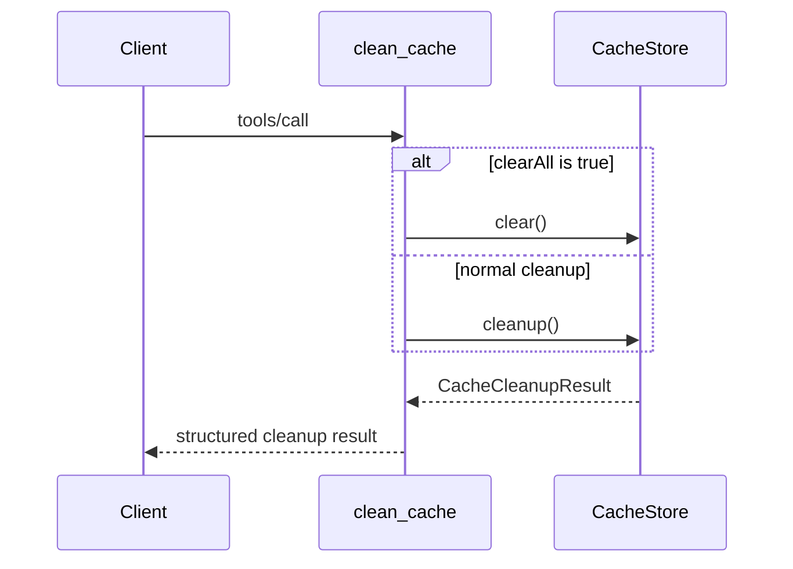

# `clean_cache`

Removes expired entries and enforces the configured size limit. With
`clearAll: true`, it removes all JARoscope-owned artifact directories and
legacy flat `.source` entries. It does not touch unrelated cache-root files.

```json
{
  "clearAll": false
}
```

```json
{
  "removedEntries": 3,
  "removedBytes": 18240
}
```


