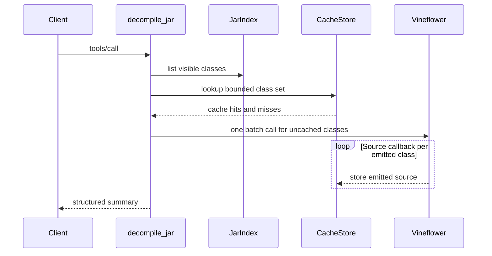

# `decompile_jar`

Explicitly decompiles visible classes into the JARoscope cache. It returns a
summary, not source content. Normal source requests remain on-demand through
`get_class_source`.

## Request

```json
{
  "jarPath": "/tmp/example.jar",
  "packagePrefix": "com.example.",
  "targetRelease": 21,
  "maxClasses": 10000
}
```

`jarPath` is required. The package prefix, target release, and class bound are
optional. The default class bound is 10,000 and the absolute bound is 100,000.

## Response

```json
{
  "classCount": 142,
  "cacheHits": 118,
  "decompiled": 24,
  "failed": 0,
  "truncated": false,
  "failureDetails": []
}
```

Individual class failures do not abort the operation. Failure details are
capped at 100 entries to bound the response.


