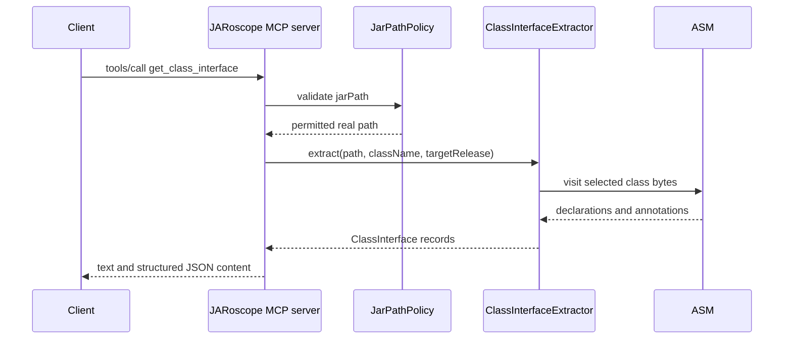

# `get_class_interface`

Extracts the declared public and protected interface of one class. The tool
includes fields, constructors, methods, generic signatures, and declared
annotations. It never loads the class or its annotation types.

## Request

```json
{
  "jarPath": "/tmp/example.jar",
  "className": "com.example.Widget",
  "targetRelease": 21,
  "includeInheritedMembers": false
}
```

`jarPath` and `className` are required. `targetRelease` defaults to the
configured release. `includeInheritedMembers` defaults to `false`. When it is
`true`, the current result remains declared-only and includes a warning until
dependency-aware inheritance resolution is implemented.

## Response

The response contains MCP text content containing JSON and matching
`structuredContent`:

```json
{
  "targetRelease": 21,
  "includeInheritedMembers": false,
  "warnings": [],
  "classInterface": {
    "binaryName": "com.example.Widget",
    "kind": "CLASS",
    "superClassName": "java.lang.Object",
    "interfaceNames": [],
    "annotations": [],
    "fields": [],
    "constructors": [],
    "methods": []
  }
}
```


