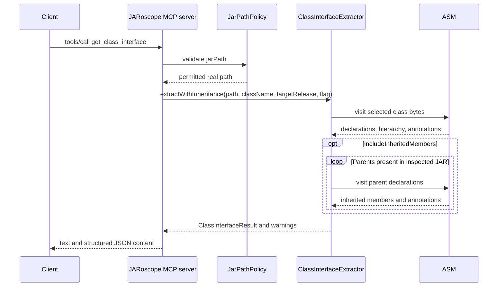

# `get_class_interface`

Extracts the declared public and protected interface of one class. The tool
includes fields, constructors, methods, generic signatures, and declared
annotations. It never loads the class or its annotation types.

## Request

```json
{
  "jarPath": "/tmp/example.jar",
  "className": "com.example.Widget",
  "targetRelease": 21,
  "includeInheritedMembers": false
}
```

`jarPath` and `className` are required. `targetRelease` defaults to the
configured release. `includeInheritedMembers` defaults to `false`. When true,
JARoscope resolves superclass and interface declarations present in the
inspected JAR. Missing parent types produce warnings and partial results.
Inherited class annotations are included only when their annotation type has
`java.lang.annotation.Inherited`; annotations are not inherited from interfaces.

## Response

The response contains MCP text content containing JSON and matching
`structuredContent`:

```json
{
  "targetRelease": 21,
  "includeInheritedMembers": false,
  "warnings": [],
  "classInterface": {
    "binaryName": "com.example.Widget",
    "kind": "CLASS",
    "superClassName": "java.lang.Object",
    "interfaceNames": [],
    "annotations": [],
    "fields": [],
    "constructors": [],
    "methods": []
  }
}
```


