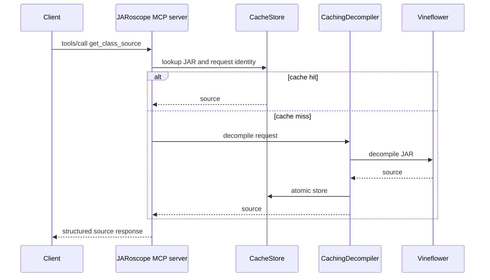

# `get_class_source`

Returns decompiled Java source for one class. The request uses the configured
cache and invokes Vineflower only when the exact source identity is absent.

## Request

```json
{
  "jarPath": "/tmp/example.jar",
  "className": "com.example.Widget",
  "targetRelease": 21
}
```

`jarPath` and `className` are required. `targetRelease` defaults to the
configured Java release. Source larger than the configured response limit is
returned as an MCP tool error. The default limit is 1 MiB.

## Response

```json
{
  "binaryName": "com.example.Widget",
  "targetRelease": 21,
  "engineVersion": "1.12.0",
  "sourceBytes": 1842,
  "source": "package com.example;\n..."
}
```


