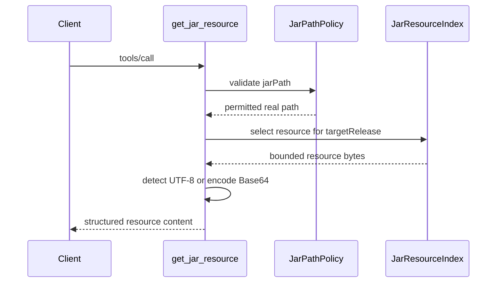

# `get_jar_resource`

Reads one non-class entry from a local JAR. Multi-release resources use the
configured Java release unless `targetRelease` is supplied. The raw resource
size must not exceed `jaroscope.response.max-jar-resource-size` (1 MiB by
default).

## Request

```json
{
  "jarPath": "/tmp/example.jar",
  "resourceName": "META-INF/services/com.example.Service",
  "targetRelease": 21
}
```

## Response

UTF-8 resources use `encoding: "utf-8"`. Non-UTF-8 resources use Base64.

```json
{
  "resourceName": "example/data.bin",
  "targetRelease": 21,
  "mimeType": "application/octet-stream",
  "encoding": "base64",
  "sizeBytes": 3,
  "content": "AQL/"
}
```


