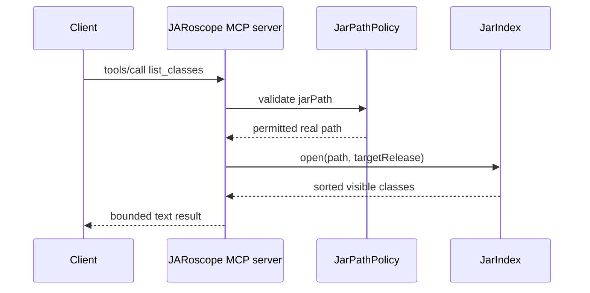

# `list_classes`

Lists binary class names visible in a local JAR. Multi-release selection uses
the configured Java release unless `targetRelease` is supplied.

## Request

```json
{
  "jarPath": "/tmp/example.jar",
  "packagePrefix": "com.example.",
  "targetRelease": 21,
  "maxResults": 100
}
```

`jarPath` is required. `packagePrefix`, `targetRelease`, and `maxResults` are
optional. Results are capped at 1,000 classes. The default limit is 100.

## Response

```text
targetRelease=21
count=2
truncated=false
com.example.Api
com.example.internal.Helper
```

Invalid arguments, banned paths, and unreadable JARs return an MCP tool error.
Diagnostics are written to stderr, never stdout.


