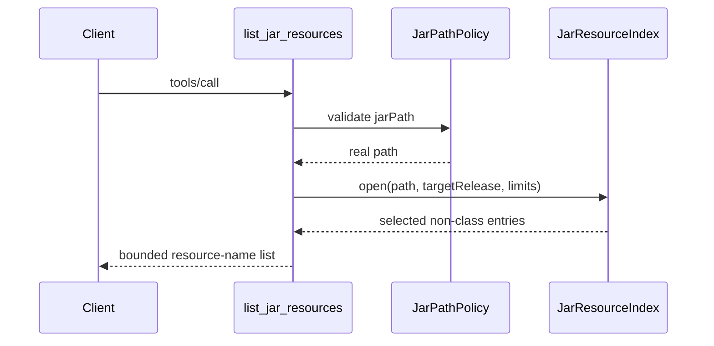

# `list_jar_resources`

Lists non-class entries in a local JAR. Versioned resources in a
multi-release JAR are shown once under their logical entry name, selecting the
highest version that does not exceed `targetRelease`.

## Request

```json
{
  "jarPath": "/tmp/example.jar",
  "resourcePrefix": "META-INF/services/",
  "targetRelease": 21,
  "maxResources": 100
}
```

`jarPath` is required. Prefix, target release, and result count are optional.
The default result count is 100, with a maximum of 1,000.

## Response

```json
{
  "targetRelease": 21,
  "count": 1,
  "truncated": false,
  "resources": [
    {
      "name": "META-INF/services/com.example.Service",
      "selectedVersion": 0,
      "sizeBytes": 31
    }
  ]
}
```


